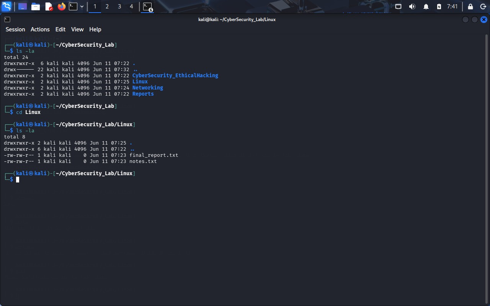

# Linux Task 01 – Linux Environment Setup & Essential Commands

## Name

Stephen J

## Objective

The objective of this task is to gain hands-on experience with the Linux operating system, terminal navigation, directory management, file management, and system information commands. This task helps build a strong foundation for Cyber Security and System Administration.

---

# Linux Environment

**Operating System:** Kali Linux

**Platform:** VMware Workstation

---

# Part A: Linux Installation & Verification

### Kali Linux Desktop


### Terminal Window


### System Information


---

# Part B: Basic Navigation Commands

The following commands were executed and verified:

| Command  | Purpose                                |
| -------- | -------------------------------------- |
| pwd      | Displays the current working directory |
| ls       | Lists files and directories            |
| ls -la   | Lists all files including hidden files |
| cd       | Changes directory                      |
| clear    | Clears terminal screen                 |
| history  | Displays command history               |
| whoami   | Displays current username              |
| hostname | Displays system hostname               |

### Navigation Commands Output


---

# Part C: Directory Management

Created the following directory structure:

```text
CyberSecurity_Lab
│
├── Networking
├── Linux
├── CyberSecurity
├── EthicalHacking
└── Reports
```

### Folder Structure Screenshot


---

# Part D: File Management

The following file management operations were performed:

### File Creation

```bash
touch notes.txt
touch commands.txt
touch report.txt
```

### File Copy

```bash
cp notes.txt notes_copy.txt
```

### File Rename

```bash
mv report.txt final_report.txt
```

### File Move

```bash
mv commands.txt ../Networking/
```

### File Delete

```bash
rm notes_copy.txt
```

### File Management Screenshot




---

# Part E: System Information Collection

The following commands were executed:

```bash
uname -a
hostname
whoami
date
uptime
pwd
```

### System Information Output


---

# Research Answers

The research answers are available in:

```text
Research_Answers/Research_Answers.txt
```

Topics Covered:

* What is Linux?
* Importance of Linux in Cyber Security
* Difference between Linux and Windows
* Linux Distributions
* Why Ethical Hackers Prefer Linux

---

# Notes

Task notes are available in:

```text
Notes/notes.txt
```

---

# Skills Learned

* Linux Terminal Basics
* Directory Navigation
* File Management
* Linux Commands
* System Information Collection
* Linux File System Structure
* Cyber Security Fundamentals

---

# Outcome

Successfully completed Linux Task 01 and gained practical experience with Linux terminal operations, directory management, file management, and system information commands using Kali Linux.

---

## Author

Stephen J
